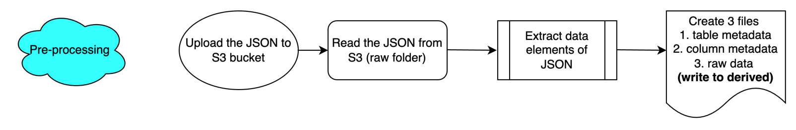
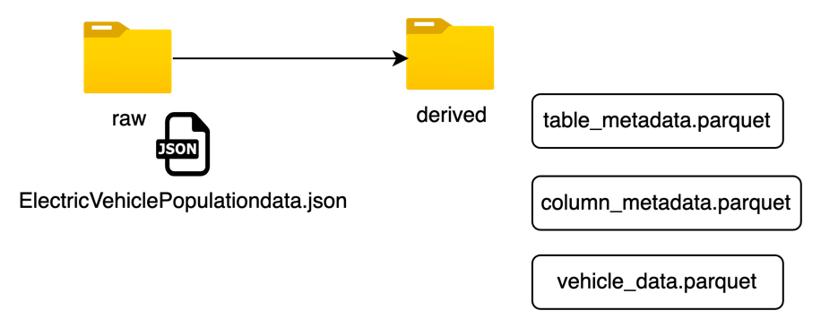

# Electric Vehicle Data Pipeline

An end-to-end data engineering pipeline built with **PySpark** and **Delta Lake** that ingests the [Washington State Electric Vehicle Population dataset](https://catalog.data.gov/dataset/electric-vehicle-population-data) (~22,000 records) from Amazon S3 and processes it through a **medallion architecture** (Bronze → Silver → Gold), with data quality validation, schema change detection, and pipeline auditing built in.

## Architecture

```
                ┌──────────────── Amazon S3 ────────────────┐
 Raw JSON  ───► │  raw/            derived/                 │
 (data.gov)     │  1 JSON file ──► 3 Parquet files          │
                └──────────┬────────────────────────────────┘
                           │
                           ▼
      ┌─────────┐    ┌──────────┐    ┌─────────┐
      │ BRONZE  │───►│  SILVER  │───►│  GOLD   │   Delta tables
      │ as-is   │    │ typed +  │    │ insight │
      │ ingest  │    │ DQ flags │    │ aggs    │
      └─────────┘    └──────────┘    └─────────┘
            └────── audit + schema-drift tracking ──────┘
```





## Pipeline stages

**1. Analyze & Extract** (`notebooks/01_analyze_and_extract.ipynb`)
Reads the raw multiline JSON from S3, explores its structure, and splits it into three datasets: table metadata, column metadata, and vehicle data. Nested arrays and structs are flattened with a recursive `flatten_json` utility, and all three are written back to S3 as Parquet.

**2. Bronze** (`notebooks/02_populate_bronze.ipynb`)
Loads the derived Parquet files into Bronze Delta tables. Column names are sanitized (spaces and special characters removed), and an MD5 hash of the schema is compared against the previous run to detect schema drift before appending data.

**3. Silver** (`notebooks/03_populate_silver.ipynb`)
Applies data types driven by the column metadata table and runs data quality checks, each of which appends an error code and message to the record rather than dropping it: US state validation (DQ01), null checks (DQ02), model year range validation (DQ03), and numeric/NaN checks. Clean and flagged records land in a managed Silver table with an `Err_flg` marker.

**4. Gold** (`notebooks/04_populate_gold.ipynb`)
Builds aggregate insight tables answering questions such as: which EV makes are most efficient by average electric range, how make preference varies by city, which plug-in hybrids (PHEVs) buyers prefer, and which make/model offers the best combination of range, price, and popularity.

**Audit framework** (`notebooks/audit_utils.ipynb`)
Shared utilities used by every stage: `update_audit_table` records start/end timestamps and status for each pipeline step, and `check_and_store_md5` detects schema changes between runs.

## Tech stack

PySpark, Delta Lake, Databricks notebooks, Amazon S3, Spark SQL, Python.

## Repository structure

```
├── data/
│   ├── README.md                  # dataset source and download instructions
│   └── sample/                    # small sample of the raw JSON
├── docs/images/                   # architecture diagrams
├── notebooks/
│   ├── 01_analyze_and_extract.ipynb
│   ├── 02_populate_bronze.ipynb
│   ├── 03_populate_silver.ipynb
│   ├── 04_populate_gold.ipynb
│   └── audit_utils.ipynb
└── README.md
```

## Running the pipeline

1. Download the full dataset (see `data/README.md`) and upload it to `s3://<your-bucket>/raw/`.
2. Set AWS credentials as environment variables (or Databricks secrets) — they are never hardcoded:
   ```bash
   export AWS_ACCESS_KEY_ID=...
   export AWS_SECRET_ACCESS_KEY=...
   ```
3. Update the S3 bucket name in the notebooks to match yours.
4. Run the notebooks in order (01 → 04) on a Spark cluster (Databricks recommended, since Bronze/Silver/Gold are written as Delta tables).

## Sample insights produced

The Gold layer answers questions like which car make is most efficient (by average electric range per make/model/county), whether EV make preference correlates with city, and which PHEV models dominate buyer preference, producing a recommendation view combining range, MSRP, and popularity.
